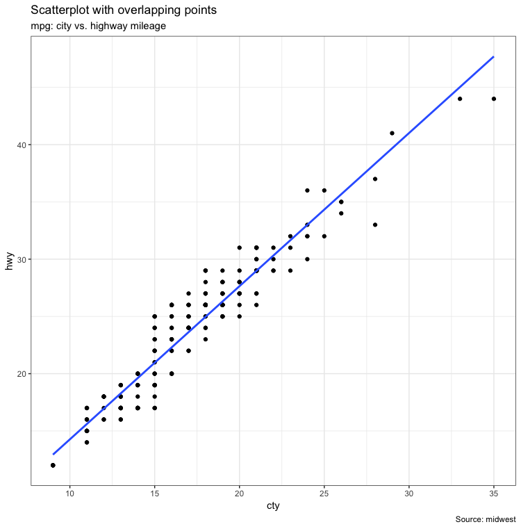

# ggplot2-the-Master-List

### Scatter plot(1)

### Scatter plot(2)

### Scatter plot(3)

### Jitter plot

### Counts chart

### Bubble plot

### Marginal Histogram/Boxplot

- Marginal Histogram

- Marginal Boxplot

- Marginal Density

### Correlogram

